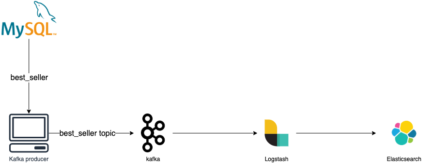

# 데이터 플랫폼
데이터 플랫폼 테스트 환경

### 포트 리스트
#### 데이터
1. mysql : 3306
1. postgres : 5432
1. redis : 6379

#### BI tool
1. redash : 5000

#### Elasticsaerch
1. elasticsearch : 9200, 9300
1. kibana : 5601

#### airflow
1. webserver : 58080, 50080
1. flower : 5555

#### spark
1. jupyterlab : 8888
1. spark-master : 9090, 7077, 6066
1. spark-worker : 8081


### 테스트 
#### 1. Kafka to Elasticsearch


Logstash plugin 설치
```
bin/logstash-plugin install logstash-integration-kafka
```
파이프라인 conf 설정
```
# /usr/share/logstash/pipeline

input {
    kafka {
        bootstrap_servers => "kafka:29092" # kafka 부트스트랩
        topics => ["best_seller"] # kafka 토픽 지정
        consumer_threads => 1 
        group_id => "book"
    }
}

filter {
}

output {
    elasticsearch {
        hosts => ["elasticsearch:9200"] # endpoint ES
        index => "best-seller" # ES index
        document_type => "_doc" 
    }
}
```

#### 2. Redash 구축
